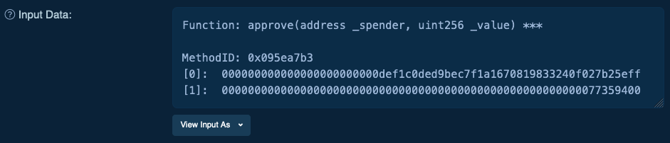
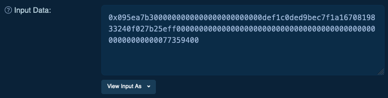
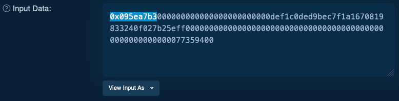
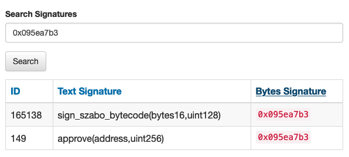
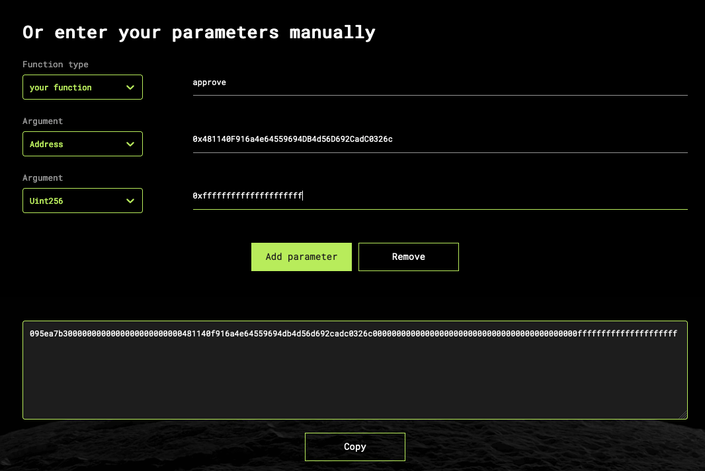
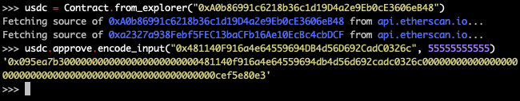

========
Calldata
========

- ``Calldata`` is data sent to a smart contract that is used to execute a transaction
- ``Calldata`` is made up by a ``method selector`` followed by concatenated ABI encoded ``method arguments``
- ``Calldata`` represents the function to call on a smart contract as well the arguments to send to the function
- ``Calldata`` is also referred to as ``input data``

Examples of calldata
====================

Parsed calldata (source: etherscan)

Raw calldata (source: etherscan)

Method signatures
=================

- A ``method signature`` is a ASCII representation of a smart contract ``method identifier``
- A ``method signature`` looks like this: ``approve(address,uint256)``
- A ``method signature`` can be generated by looking at a solidity function's ``name`` and ``input types``
- A ``method signature`` can be generated by looking at an ABI method's ``name`` and ``input types``
- A ``method signature`` can be hashed using the ``keccak256`` (sha3) algorithm to create a ``method selector``

.. note::
    There are no spaces between method signature arguments. For example ``address,uint256`` is correct and ``address, uint256`` is not. If you add spaces to a method selector and try to call the selector it will not work.

Examples
--------

Solidity method definition example for ``approve(address,uint256)`` (Taken from USDC):

.. code-block:: python

    function approve(address spender, uint256 amount) external returns (bool);

ABI method definition example for ``approve(address,uint256)``:

.. code-block:: json

    {
      "inputs": [
        {
          "internalType": "address",
          "name": "spender",
          "type": "address"
        },
        {
          "internalType": "uint256",
          "name": "amount",
          "type": "uint256"
        }
      ],
      "name": "approve",
      "outputs": [
        {
          "internalType": "bool",
          "name": "",
          "type": "bool"
        }
      ],
      "stateMutability": "nonpayable",
      "type": "function"
    }

Method selectors
================
- A ``method selector`` is a 4 byte (8 character) hexadecimal representation of a ``method signature``
- Method selectors are generated by taking the first (big endian) 4 bytes of ``keccak256(methodSignature)``
- A ``method selector`` looks like this: ``0x095ea7b3``
- Every time a method (or function) is called in EVM a ``method selector`` is used to find and execute the code
- When sending a transaction to a smart contract the first 4 bytes of ``input data`` (or ``calldata``) is the method selector
- Method selectors are sometimes referred to as method signature hashes (``sig hashes``) or ``method IDs``

.. note::
    It is possible for one method selector to represent multiple hashed method signatures. This is called a ``collision``.

Extracting method selectors from calldata
-----------------------------------------

1. `Open a transaction <https://etherscan.io/tx/0x04ffa26bf38e3c087cd649a453a58515d11b1344518acfea98290ca5ed92e454>`_ in etherscan
2. Scroll down to the bottom
3. Click "Click to see More"
4. Click "View Input As"
5. Select "Original"
6. Select the first 8 characters after "0x"
7. The selected text is the transaction's entry point method selector

Parsing method selector sig hashes
----------------------------------

In some cases it's possible to parse method selector sighashes. Although hashing a method signature is a one way function there are free services available that scrape uploaded ABIs for relevant sig hashes and maintain a look-up-table database. One such service is `Ethereum Signature Database <https://4byte.directory>`_.

1. Go to https://www.4byte.directory/
2. Enter a method selector sig hash
3. View the decoded sighash (if there is a sighash available)

Generating signature hashes
---------------------------

Manually
^^^^^^^^

1. Go to `Keccak256 Hash Generator <https://bfotool.com/keccak256-hash-generator>`_
2. Type ``approve(address,uint256)`` in the input field
3. Press ``Generate Hash``
4. Copy the hash
5. Extract the first (left most) 8 characters from the hash
6. You should end up with ``095ea7b3``

Using solidity
^^^^^^^^^^^^^^

.. code-block:: python

    bytes4 selector = bytes4(keccak256("decimals()"));
    
Generating calldata
===================

Method selectors by themselves are often not enough to generate transaction calldata. In order to generate calldata a user must concatenate ABI encoded input arguments to the method selector. Some methods for generating complete calldata are outlined below.

Using ABI Hash Hex
------------------
1. Go to https://abi.hashex.org
2. Scroll down
3. Under "Function type" click on "constructor" and then select "your function"
4. Enter a function name (enter "approve" for this example)
5. Click "Add parameter"
6. Under "Argument" click "Select"
7. Type "address" and press enter
8. Enter an address on the right
9. Click "Add parameter"
10. Type "uint256" and press enter
11. Enter a number or hex string on the right
12. You've now generated ABI encoded calldata consisting of a method selector (first 4 bytes) and encoded calldata
13. This calldata can be used to manually send a raw transaction

Using Brownie
-------------

1. Open brownie console: ``brownie console --network mainnet``
2. Fetch USDC contract: ``usdc = Contract.from_explorer("0xA0b86991c6218b36c1d19D4a2e9Eb0cE3606eB48")``
3. Enter usdc.method.encode_input(args): ``usdc.approve.encode_input("0x481140F916a4e64559694DB4d56D692CadC0326c", 55555555555)``
4. Calldata is printed

Using solidity
--------------

abi.encodeWithSignature
^^^^^^^^^^^^^^^^^^^^^^^

.. code-block:: python
    
    bytes memory encodedSelector = abi.encodeWithSignature("approve(address,uint256)", 0x481140F916a4e64559694DB4d56D692CadC0326c, 0xffffff);

abi.encodeWithSelector
^^^^^^^^^^^^^^^^^^^^^^

.. code-block:: python
    
    bytes memory encodedSelector = abi.encodeWithSelector(bytes4(keccak256("approve(address,uint256)")), 0x481140F916a4e64559694DB4d56D692CadC0326c, 0xffffff);

.. code-block:: python
    
    bytes memory encodedSelector = abi.encodeWithSelector(0x095ea7b3, 0x481140F916a4e64559694DB4d56D692CadC0326c, 0xffffff);

.. code-block:: python
    
    bytes memory encodedSelector = abi.encodeWithSelector(tokenInterface.approve.selector, 0x481140F916a4e64559694DB4d56D692CadC0326c, 0xffffff);

References
==========
- `Medium - What are ABI encoding functions in solidity <https://medium.com/@libertylocked/what-are-abi-encoding-functions-in-solidity-0-4-24-c1a90b5ddce8>`_
- `Solidity Documentation - Function selectors <https://docs.soliditylang.org/en/v0.8.6/abi-spec.html?highlight=selector#function-selector>`_
- `Keccak256 Hash Generator <https://bfotool.com/keccak256-hash-generator>`_
- `ABI Hash Hex <https://abi.hashex.org/>`_
- `Ethereum Signature Database <https://4byte.directory>`_