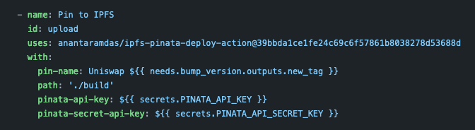

=====================
Decentralized hosting
=====================

IPFS
====

What is IPFS
------------
IPFS is a distributed system for storing and accessing files, websites, applications, and data.

`More Info <https://docs.ipfs.io/concepts/what-is-ipfs/#decentralization>`_

Installing IPFS CLI
-------------------
1. Follow official `installation instructions for IPFS CLI <https://docs.ipfs.io/install/command-line/>`_
2. Initialize IPFS using this command: ``ipfs init``

.. note::
    When you initialize IPFS you are generating your own unique private key. This key can be used to publish to IPNS.

Posting a file
--------------
1. Start IPFS daemon if it isn't running already: ``ipfs daemon``
2. Create a file: ``echo "Hello, world" > hello.txt``
3. Add file to IPFS: ``ipfs add hello.txt``

.. note::
    A posted file is available as long as it is regularly downloaded/accessed. In order to keep a file available longer term the file must be ``pinned`` (see info below).

Downloading a file
------------------
1. Use the "cat" command to view a file: ``ipfs cat QmaMLRsvmDRCezZe2iebcKWtEzKNjBaQfwcu7mcpdm8eY2``

Pinning a file
--------------
The most common pinning service is called `pinata <https://pinata.cloud>`_.

You can pin a file using pinata or you can also host your own node and pin to your node.

Hosting a website with IPFS
---------------------------
It's possible to pin a website using a github action.

See this `uniswap github action <https://github.com/Uniswap/uniswap-interface/blob/main/.github/workflows/release.yaml>`_ for an example.

Running an IPFS Node
--------------------
1. Follow official `instructions <https://docs.ipfs.io/how-to/command-line-quick-start/#take-your-node-online>`_

Installing IPFS Desktop
-----------------------
1. Follow official `installation instructions for IPFS Desktop <https://docs.ipfs.io/install/ipfs-desktop/>`_

.. note::
    Running IPFS Desktop runs the IPFS daemon in the background and also provides a UI for uploading and browsing IPFS.

IPNS
====

Set an IPNS hash
----------------
1. Enter: ``ipfs name publish /ipfs/QmXEgzP9TP4eYdZ2SiF7kt3VS9TTXS5FPTF1fxTdVxTu88`` (or whatever your IPFS file hash was)
2. Wait until you see a successful publish message
3. View your file by visiting ``https://gateway.ipfs.io/ipns/<your-hash>``

Update an IPFS hash
-------------------
1. Follow the same steps as above
2. View your file on the IPFS gateway (same address in step 3 above)

References
==========
`IPFS CLI Documentation <https://docs.ipfs.io/reference/cli/>`_

IPLD
====

TODO

libp2p
======

TODO
