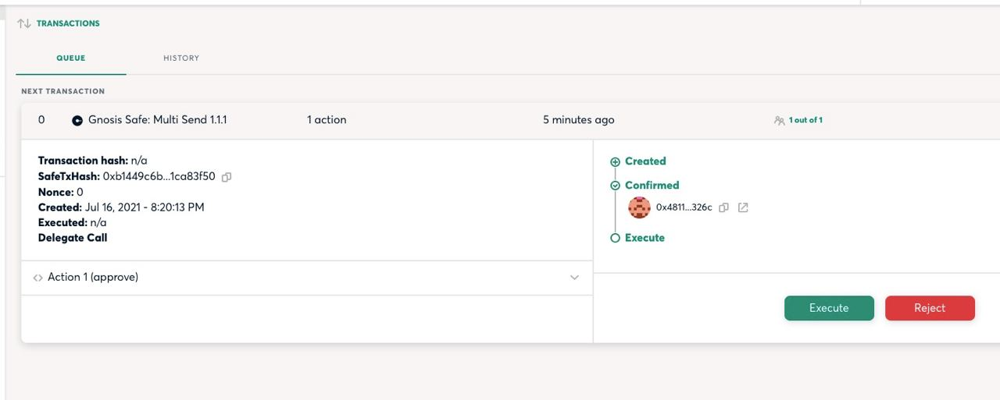
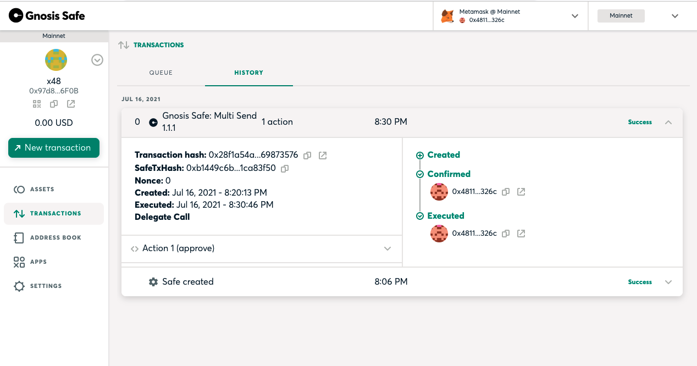

========
Multisig
========

Background
==========
A multisig wallet is a contract-based wallet where one or more users are required to sign a transaction in order to execute the transaction.

Multisig wallets are important because they provide a layer accountability for DAOs, limiting the need to trust a single individual to execute transactions on behalf of the DAO.

It is common for multisig wallet membership to be comprised of prominent members across various DAOs rather than just contributors to the DAO the wallet belongs to.

A multisig wallet often holds the treasury funds of a DAO.

Gnosis
======
The most popular multisig wallet is called ``Gnosis Safe``.

Gnosis provided an easy to use interface that allows non-technical multisig signers to sign and execute transactions.

In a Gnosis Safe, in order to execute a transaction a predefined percentage of multisig signers are required to sign a transaction before submitting (for instance 3 out of 5 signers).

Transactions are signed and aggregated off-chain using Gnosis infrastructure, and in some cases are submitted using a Gnosis transaction relayer.

Once a transaction signature count has reached the required quota the transaction may be executed by any member of the multisig.

Making a safe
-------------
1. Visit https://gnosis-safe.io/app/#/welcome
2. Click ``Connect Wallet``
3. Click ``Create New Safe``
4. Enter the name of the Safe
5. Click ``Start``
6. Select transaction signer quota requirements
7. Hit ``Review``
8. Hit ``Submit``
9. Confirm transaction in Metamask
10. Wait for transaction to complete
11. Copy safe address

ApeSafe
=======
`ApeSafe <https://safe.banteg.xyz/>`_ is a tool written by `Banteg <https://twitter.com/bantg>`_ of `Yearn <https://yearn.finance/>`_.

ApeSafe allows users to create complex transactions to be submitted to Gnosis using `Brownie <https://eth-brownie.readthedocs.io/en/stable/>`_.

Installing ApeSafe
------------------
1. Install ape-safe: ``pip install -U ape-safe``
2. Install gnosis-py: ``pip install gnosis-py``
3. Install ganache-cli: ``npm install -g ganache-cli``

Initializing Brownie
--------------------
In order to submit transactions using ApeSafe you must first add a signer account to Brownie.

1. Add an account: ``brownie accounts new <id>``
2. Enter in private key
3. Ensure account was added: ``brownie accounts list``

Building a transaction
----------------------
.. code-block:: python

    from ape_safe import ApeSafe
    safe = ApeSafe('ychad.eth')

    dai = safe.contract('0x6B175474E89094C44Da98b954EedeAC495271d0F')
    vault = safe.contract('0x19D3364A399d251E894aC732651be8B0E4e85001')

    amount = dai.balanceOf(safe.account)
    dai.approve(vault, amount)
    vault.deposit(amount)

    safe_tx = safe.multisend_from_receipts()
    safe.preview(safe_tx)
    
Submitting a transaction
------------------------
Once you've built your transaction (above) you can submit the transaction to Gnosis

.. code-block:: python

    safe.post_transaction(safe_tx)

After you post your transaction open your safe (replace 0xFEB... with your safe address):

https://gnosis-safe.io/app/#/safes/0xFEB4acf3df3cDEA7399794D0869ef76A6EfAff52/transactions    

If the transaction was successfully submitted you should see something like this:

At this point other signers may sign the transaction.

Once there are enough transactions any signer can press the ``Execute`` button to submit the transaction.

After a transaction is successfully submitted you will your executed transaction in the "History" section of the "Transactions" page on Gnosis.

